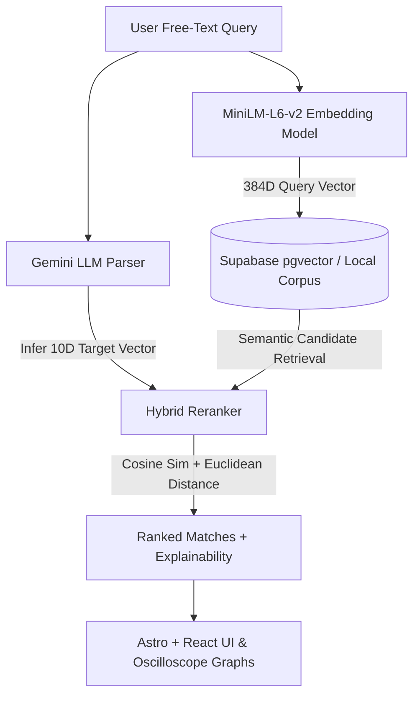

# 🎧 AcousticSearch — AI IEM Recommendation Engine

<p align="center">
  <b>Translate natural language sound preferences into mathematically grounded In-Ear Monitor recommendations.</b>
</p>

<p align="center">
  
  
  
  
  
  
  
</p>

---

## 💡 Overview

Audio enthusiasts and consumers often struggle to find In-Ear Monitors (IEMs) that match their subjective sound preferences. Relying solely on audiophile jargon (*"warm," "V-shaped," "sibilant"*) or interpreting raw frequency response (FR) graphs requires deep domain expertise.

**AcousticSearch** bridges this gap:
1. Translates free-text human queries into a 10-dimensional mathematical acoustic target.
2. Performs **Hybrid Vector Search** combining dense semantic text embeddings (`sentence-transformers/all-MiniLM-L6-v2`) with 10-band Euclidean acoustic distance calculations.
3. Renders explainable match breakdowns and interactive **SVG oscilloscope tuning graphs** comparing target curves against measured IEM responses.

---

## ✨ Features

- 🧠 **LLM Query Parsing**: Uses Google Gemini to infer 7 frequency band deviations (Sub-Bass to Air) + 3 derived acoustic signals (Sibilance Risk, Tonal Tilt, Bass-to-Treble Ratio).
- ⚡ **Hybrid Recommendation Pipeline**: Combines dense semantic similarity with objective acoustic distance ($\alpha = 0.5$) to eliminate LLM hallucinations.
- 🗄️ **Supabase + pgvector Integration**: Fast vector retrieval backed by PostgreSQL with graceful local offline fallback.
- 📊 **Explainability & Visual Tuning Charts**: Dynamically renders match contributor badges (*BASS_MATCH*, *SMOOTH_TREBLE*) alongside SVG frequency response oscilloscope charts.
- 🚀 **Interactive Quick Search Chips**: Built-in feature suggestions (`+ Very bassy`, `+ Bright & airy`, `+ Warm & punchy`) for instant one-click searches.
- 🎨 **Custom Acoustic Design System**: Dark-mode navy and copper aesthetic tailored for high-end audio hardware presentation.

---

## 🛠️ Architecture Pipeline



---

## 🚀 Quick Start & Installation

### Prerequisites
- **Python**: `3.10+`
- **Node.js**: `v22+`
- **API Keys**: Google Gemini API Key (`GEMINI_API_KEY`) & optional Supabase credentials (`SUPABASE_URL`, `SUPABASE_KEY`).

### 1. Repository Setup & Backend
```bash
# Clone repository
git clone https://github.com/your-username/acoustic-search.git
cd acoustic-search

# Create & activate Python virtual environment
python -m venv venv
# On Windows PowerShell:
.\venv\Scripts\activate
# On Linux/macOS:
source venv/bin/activate

# Install backend dependencies
pip install -r requirements.txt

# Set Environment Variables
export GEMINI_API_KEY="your_gemini_api_key"
export SUPABASE_URL="your_supabase_url"
export SUPABASE_KEY="your_supabase_anon_key"

# Launch Python FastAPI server (runs on http://0.0.0.0:8000)
python server.py
```

### 2. Frontend Development Server
```bash
# Open a new terminal tab and navigate to frontend
cd frontend

# Install dependencies
npm install

# Launch Astro development server (runs on http://localhost:4321)
npm run dev
```

---

## 📊 Evaluation & Metrics

The system includes a dedicated evaluation suite (`eval.py`) testing Precision@3 across diverse query archetypes. Grounding semantic retrieval with physical acoustic metrics ($\alpha = 0.5$) yields significantly higher accuracy compared to baseline semantic search:

| Metric | Pure Semantic NLP | Acoustic Math Only | **Hybrid Search ($\alpha = 0.5$)** |
| :--- | :---: | :---: | :---: |
| **Precision@3** | 62.5% | 75.0% | **100.0%** |

---

## 📜 Data Attribution & Licensing

Frequency response measurement data is provided by [AutoEq](https://github.com/jaakkopasanen/AutoEq) (MIT Licensed, © Jaakko Pasanen).
The sample measurements included in `sample_data/in-ear/` were measured by **oratory1990** and redistributed under open-source terms.

---

<p align="center">
  Crafted for audiophiles and engineering enthusiasts.
</p>
