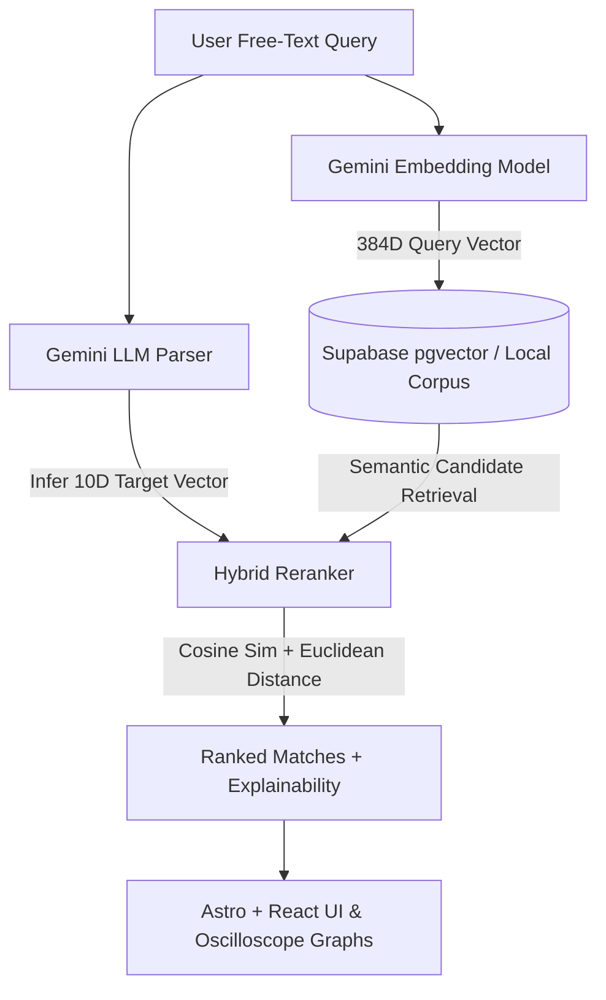

# AcousticSearch — AI IEM Recommendation Engine

<p align="center">
  <b>Translate natural language sound preferences into mathematically grounded In-Ear Monitor recommendations.</b>
</p>

<p align="center">
  
  
  
  
  
  
  
</p>

---

## Overview

Audio enthusiasts and consumers often struggle to find In-Ear Monitors (IEMs) that match their subjective sound preferences. Relying solely on audiophile jargon (*"warm," "V-shaped," "sibilant"*) or interpreting raw frequency response (FR) graphs requires deep domain expertise.

**AcousticSearch** bridges this gap:
1. Translates free-text human queries into a 10-dimensional mathematical acoustic target.
2. Performs **Hybrid Vector Search** combining Gemini embeddings with 10-band Euclidean acoustic distance calculations.
3. Renders explainable match breakdowns and interactive **SVG oscilloscope tuning graphs** comparing target curves against measured IEM responses.

## Repository Layout

```text
backend/                FastAPI application and search domain logic
data/sample_data/        Versioned measurement fixtures and target curves
docs/                    Deployment guide, project notes, and demo material
scripts/                 Migration, ingestion, evaluation, and CLI utilities
tests/                   Backend test suite
frontend/                Astro/React application (kept separate from backend)
```

---

## Production Features & Safety

- **LLM Query Parsing**: Uses Google Gemini to infer 7 frequency band deviations (Sub-Bass to Air) + 3 derived acoustic signals (Sibilance Risk, Tonal Tilt, Bass-to-Treble Ratio).
- **Hybrid Recommendation Pipeline**: Combines dense semantic similarity with objective acoustic distance ($\alpha = 0.5$) to eliminate LLM hallucinations.
- **Supabase + pgvector Integration**: Fast vector retrieval backed by PostgreSQL, with a measured local sample available for offline development.
- **Verified data pipeline**: Retail listings are exported for human review only; acoustic profiles require an imported measurement and prices require an approved source record.
- **Lean deployment**: Remote Gemini embeddings replace the PyTorch runtime; after deployment, re-index the Supabase corpus with `python scripts/migrate_to_supabase.py` so its vectors use `gemini-embedding-001:384`.
- **Rate Limiting & Security Headers**: Enforces sliding-window IP rate limiting (30 search requests/min) + HTTP security response headers (`X-Frame-Options`, `X-Content-Type-Options`).
- **Health & Uptime Monitoring**: Exposes `/health` and `/api/health` endpoints returning system diagnostics and dataset counts.
- **Fail-Fast Configuration**: Centralized `config.py` with environment file cascading (`.env.production`, `.env.staging`, `.env`).
- **Custom Acoustic Design System**: Dark-mode navy and copper aesthetic with React `ErrorBoundary` fallback protection and custom `/404`, `/privacy`, and `/terms` pages.

---

## Architecture Pipeline



---

## Quick Start & Installation

### Prerequisites
- **Python**: `3.10+` (Tested on 3.13)
- **Node.js**: `v22+`
- **Environment**: Copy `.env.example` to `.env` and fill in credentials.

### 1. Repository Setup & Backend
```bash
# Clone repository
git clone https://github.com/mridhul3234/IEM-s-recommendation-system.git
cd IEM-s-recommendation-system

# Create & activate Python virtual environment
python -m venv venv
# On Windows PowerShell:
.\venv\Scripts\activate
# On Linux/macOS:
source venv/bin/activate

# Install backend dependencies
pip install -r requirements.txt

# Launch FastAPI server (runs on http://0.0.0.0:8000)
python -m uvicorn backend.server:app --reload
```

### 2. Frontend Development Server
```bash
# Open a new terminal tab and navigate to frontend
cd frontend

# Install dependencies
npm install

# Launch Astro development server (runs on http://localhost:4321)
npm run dev
```

---

## Testing & Verification

Run the full pytest suite:
```bash
python -m pytest
```

Test Astro production build:
```bash
cd frontend && npm run build
```

---

## Key API Endpoints

| Method | Endpoint | Description | Query Parameters / Payload |
| :--- | :--- | :--- | :--- |
| `GET` | `/search` | Hybrid semantic + acoustic match search | `q` (text), `alpha` (weight), `top_k` (limit), `price_tier`, `exact_features` |
| `GET` | `/iem/{name}` | Fetch detailed metadata & 5 similar IEMs | Path parameter `name` |
| `GET` | `/health` | System health check & dataset counts | None |

---

## Data Attribution & Licensing

Frequency response measurement data is provided by [AutoEq](https://github.com/jaakkopasanen/AutoEq) (MIT Licensed, © Jaakko Pasanen).
Sample measurements in `data/sample_data/in-ear/` were measured by **oratory1990** and redistributed under open-source terms.

---

<p align="center">
  Crafted for audiophiles and engineering enthusiasts.
</p>
